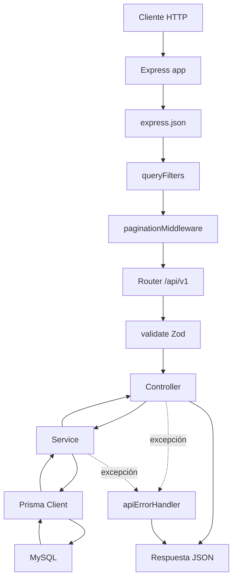

# Funcionamiento del código del API

## 1. Propósito

El proyecto implementa una API REST para administrar:

- jugadores (`players`);
- géneros (`genres`);
- videojuegos (`games`);
- puntuaciones (`scores`), incluyendo ranking y estadísticas.

La API está construida con Express, TypeScript, Zod y Prisma sobre MySQL. Las rutas de negocio están versionadas bajo `/api/v1`.

## 2. Estructura del proyecto

```text
src/
├── server.ts                         # composición de la aplicación Express
├── core/
│   ├── prisma.ts                     # cliente Prisma y adaptador MariaDB
│   ├── openapi.ts                    # contrato OpenAPI generado con Swagger
│   ├── middlewares/                  # filtros, paginación, validación y errores
│   ├── utils/                        # utilidades reutilizables
│   └── __tests__/                    # pruebas del core
├── modules/
│   ├── players/
│   ├── genres/
│   ├── games/
│   └── scores/
└── test-utils/                       # infraestructura de pruebas HTTP

prisma/
├── schema.prisma                     # modelos y relaciones de datos
├── migrations/                       # cambios versionados de la base
└── seed.ts                           # carga inicial desde una API pública

docs/
├── architecture/code-overview.md    # este documento
└── testing/unit-testing.md           # documentación de pruebas
```

Cada módulo mantiene sus contratos en `interfaces`, sus validaciones y DTOs en `dtos`, y separa router, controller y service. No se utilizan archivos barril.

## 3. Flujo de una solicitud



El orden se registra en `src/server.ts`:

1. `registerCoreMiddlewares(app)` registra los middlewares globales.
2. Se desactiva el header `X-Powered-By`.
3. Se montan los routers versionados.
4. Se exponen OpenAPI y Scalar.
5. Se registra el endpoint raíz.
6. `apiErrorHandler` queda al final para recibir errores de las rutas.

Express 5 propaga automáticamente las promesas rechazadas de los controladores hacia el manejador de errores.

## 4. Composición de `server.ts`

`src/server.ts` crea y exporta la instancia `app`.

### Rutas de negocio

| Recurso | Prefijo |
|---|---|
| Players | `/api/v1/players` |
| Genres | `/api/v1/genres` |
| Games | `/api/v1/games` |
| Scores | `/api/v1/scores` |

El prefijo de scores también contiene:

- `/api/v1/scores/ranking`;
- `/api/v1/scores/stats`.

### Documentación

- `GET /openapi.json` devuelve el contrato OpenAPI 3.0.3.
- `GET /docs` sirve la interfaz interactiva de Scalar usando ese contrato.

### Endpoint raíz

`GET /` devuelve un mensaje de disponibilidad y las URLs versionadas principales.

El servidor escucha en `PORT` o en el puerto `3000` por defecto. No inicia el listener cuando `NODE_ENV=test`, lo que permite que las pruebas creen servidores temporales.

## 5. Middlewares del core

### `queryFilters`

Archivo: `src/core/middlewares/query-filters.middleware.ts`

Centraliza los parámetros de consulta en `res.locals.filters`.

- Solo acepta las claves configuradas en `register-core-middlewares.ts`.
- Recorta espacios de los valores de texto.
- Convierte a número las claves configuradas como numéricas.
- Ignora valores vacíos y números no finitos.
- Descarta nombres legacy en español como `nombre`, `pagina` o `cantidadRegistros`.

Ejemplo:

```text
GET /api/v1/games?name=  Zelda  &genreId=7&unknown=value

res.locals.filters = {
  name: "Zelda",
  genreId: 7
}
```

### `paginationMiddleware`

Archivo: `src/core/middlewares/pagination.middleware.ts`

Convierte `page` y `limit` en `res.locals.pagination`.

Valores por defecto:

```json
{
  "page": 1,
  "limit": 20,
  "skip": 0,
  "take": 20
}
```

Para `page=3&limit=25`, calcula `skip=50` y `take=25`.

Los services envían `skip` y `take` a Prisma y devuelven las colecciones con esta estructura:

```json
{
  "data": [],
  "totalRecords": 0
}
```

### `validate`

Archivo: `src/core/middlewares/validation.middleware.ts`

Recibe un esquema de Zod y un destino: `body`, `params` o `query`.

- Si la validación falla, responde HTTP `400`.
- Devuelve `error: "Error de validación"`.
- Devuelve cada error como `{ field, message }`.
- Conserva los mensajes en español definidos en cada DTO.
- Si la validación es exitosa, reemplaza el valor por el resultado validado.

### `apiErrorHandler`

Archivo: `src/core/middlewares/error-handler.middleware.ts`

Convierte errores conocidos de Prisma en respuestas HTTP:

| Código Prisma | HTTP | Mensaje |
|---|---:|---|
| `P2002` | 400 | Ya existe un registro con los datos proporcionados |
| `P2003` | 400 | La referencia especificada no existe o no es válida |
| `P2025` | 404 | Registro no encontrado |
| desconocido | 500 | Error interno del servidor |

Si los headers ya fueron enviados, delega el error al siguiente handler de Express.

## 6. Arquitectura de cada módulo

Todos los módulos siguen el mismo flujo:

```text
router → validate → controller → service → prisma
```

### Router

El router:

- define los métodos HTTP;
- aplica los esquemas Zod apropiados;
- crea el service y el controller;
- enlaza los métodos del controller con `.bind(controller)`.

### Controller

El controller trabaja con `Request` y `Response`.

- Obtiene datos de `req.body`, `req.params` y `res.locals`.
- Convierte los IDs de ruta a número.
- Invoca el contrato del service.
- Decide el status HTTP exitoso.
- Envía la respuesta JSON.

No contiene consultas directas a Prisma.

### Service

El service contiene la lógica de persistencia y negocio.

- Construye los filtros de Prisma.
- Configura ordenamiento, paginación e inclusiones.
- Ejecuta operaciones CRUD.
- Formatea las colecciones paginadas.
- Lanza errores para que `apiErrorHandler` los traduzca.

### Interfaces

Cada módulo declara contratos independientes en `<module>/interfaces`:

- `IPlayerController` e `IPlayerService`;
- `IGenreController` e `IGenreService`;
- `IGameController` e `IGameService`;
- `IScoreController` e `IScoreService`.

Las clases concretas implementan esos contratos con `implements`.

## 7. Funcionamiento por módulo

### Players

`PlayerService.getAll` admite filtros por `name`, `gamertag`, `email`, `search`, fechas y período. También acepta ordenamiento y paginación.

`getById` devuelve el jugador junto con sus puntuaciones, videojuegos y géneros relacionados.

El módulo expone:

```text
GET    /api/v1/players
GET    /api/v1/players/:id
POST   /api/v1/players
PUT    /api/v1/players/:id
DELETE /api/v1/players/:id
```

### Genres

`GenreService.getAll` filtra por nombre, ordena y agrega `_count.games` para cada género.

`getById` incluye los videojuegos del género.

El módulo expone:

```text
GET    /api/v1/genres
GET    /api/v1/genres/:id
POST   /api/v1/genres
PUT    /api/v1/genres/:id
DELETE /api/v1/genres/:id
```

### Games

`GameService.getAll` permite filtrar por nombre, `genreId` y `genreName`. Las consultas incluyen el género.

`getById` incluye el género y las puntuaciones con sus jugadores.

El módulo expone:

```text
GET    /api/v1/games
GET    /api/v1/games/:id
POST   /api/v1/games
PUT    /api/v1/games/:id
DELETE /api/v1/games/:id
```

### Scores

`ScoreService.getAll` permite filtrar por jugador, videojuego, género, rango de puntaje, fechas y período.

`getRanking` reutiliza los filtros, ordena por puntaje descendente por defecto y calcula la posición considerando el offset de paginación.

`getStats` consulta los totales de jugadores, videojuegos y puntuaciones, y calcula el promedio redondeado a dos decimales.

El módulo expone:

```text
GET    /api/v1/scores
POST   /api/v1/scores
DELETE /api/v1/scores/:id
GET    /api/v1/scores/ranking
GET    /api/v1/scores/stats
```

## 8. DTOs y validación

Cada módulo define sus interfaces de entrada y esquemas Zod en `dtos`.

Ejemplo de creación de videojuego:

```json
{
  "name": "Tekken 8",
  "genreId": 4
}
```

El esquema valida que:

- `name` sea texto no vacío;
- `genreId` sea un entero positivo;
- los campos obligatorios estén presentes.

`src/core/utils/zod.util.ts` concentra constructores reutilizables para texto requerido, texto opcional, enteros positivos, números no negativos, períodos, fechas y correos electrónicos.

## 9. Persistencia

`src/core/prisma.ts` crea el cliente Prisma con `PrismaMariaDb` y usa `DATABASE_URL`.

El esquema define las tablas en inglés:

```text
players
genres
games
scores
```

Relaciones principales:

```text
Player 1 ──── N Score
Game   1 ──── N Score
Genre  1 ──── N Game
```

Las relaciones de `Score` con `Player` y `Game` usan eliminación en cascada. La relación de `Game` con `Genre` restringe la eliminación de géneros que todavía tienen videojuegos.

Las migraciones mantienen la evolución del esquema y contemplan la migración de datos desde las tablas legacy en español antes de eliminarlas.

## 10. Seeder

Archivo: `prisma/seed.ts`

El seeder:

1. consulta `https://www.freetogame.com/api/games`;
2. normaliza y deduplica los juegos;
3. elimina puntuaciones, jugadores, juegos y géneros existentes;
4. crea los géneros obtenidos del catálogo público;
5. crea cinco jugadores de demostración;
6. crea los videojuegos del catálogo;
7. registra siete puntuaciones iniciales.

La limpieza inicial es intencional: el seeder reconstruye los datos de demostración y no debe ejecutarse contra una base con información que se quiera conservar.

## 11. OpenAPI y Scalar

`src/core/openapi.ts` construye el contrato OpenAPI mediante `swagger-jsdoc`.

El contrato contiene:

- operaciones de todos los módulos;
- parámetros de filtros, orden y paginación;
- cuerpos de creación y actualización;
- esquemas de respuesta;
- errores de validación y persistencia;
- ranking y estadísticas.

`server.ts` expone el documento en `/openapi.json` y monta Scalar en `/docs` usando ese documento como fuente.

## 12. Configuración y ejecución

Variables principales:

```text
DATABASE_URL
NODE_ENV
CORS_ORIGIN
PORT
```

`CORS_ORIGIN` define el origen permitido para clientes web y usa `http://localhost:5173` por defecto.

Comandos habituales:

```bash
npm run build
npm run dev
npm run start
npm run seed
npm test -- --runInBand
```

Para desarrollo, `docker-compose.yml` levanta MySQL 9.7 y configura la base usando las variables de entorno del archivo `.env`.

## 13. Pruebas

Las pruebas de módulos mockean Prisma y ejecutan las rutas mediante servidores Express temporales. Las pruebas del core cubren utilidades y middlewares de forma aislada.

La cobertura detallada de casos RF/CP se encuentra en [docs/testing/unit-testing.md](../testing/unit-testing.md).
